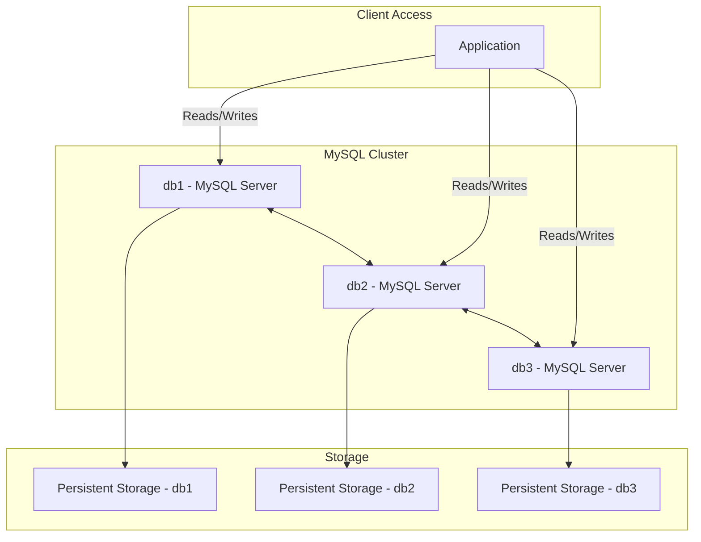

# High-Availability MySQL Database Cluster on RHEL



## Objective:
Set up a high-availability MySQL database cluster using Red Hat Enterprise Linux (RHEL). The cluster will use MySQL Group Replication for high availability and redundancy.

## Project Overview:
1. Setup Red Hat Enterprise Linux (RHEL) Servers
2. Install and Configure MySQL Database
3. Configure MySQL Group Replication
4. Verify High Availability

### 1. Setup Red Hat Enterprise Linux (RHEL) Servers

#### Provisioning:
- Provision at least three RHEL servers (e.g., `db1`, `db2`, and `db3`) to act as MySQL nodes.

#### Basic Configuration:
- Install Updates:
  ```bash
  sudo yum update -y
  ```

- Configure Networking and Hostnames:
  ```bash
  sudo hostnamectl set-hostname db1
  ```

  Do the same for `db2` and `db3`, and ensure all servers can communicate with each other.

- Set up Firewall Rules:
  ```bash
  sudo firewall-cmd --permanent --add-port=3306/tcp
  sudo firewall-cmd --permanent --add-port=33060/tcp
  sudo firewall-cmd --reload
  ```

### 2. Install and Configure MySQL Database

#### Install MySQL Repository:
```bash
sudo dnf install https://dev.mysql.com/get/mysql80-community-release-el8-1.noarch.rpm
```

#### Install MySQL Server:
```bash
sudo dnf install mysql-community-server -y
```

#### Start and Enable MySQL Service:
```bash
sudo systemctl start mysqld
sudo systemctl enable mysqld
```

#### Secure MySQL Installation:
```bash
sudo mysql_secure_installation
```
Follow the prompts to set up the root password and secure the installation.

#### Configure MySQL for Group Replication:
Edit the MySQL configuration file (`/etc/my.cnf`) on each server and add the following settings:
```ini
[mysqld]
server-id=1 # Change server-id for each node (2 for db2, 3 for db3)
log-bin=mysql-bin
binlog-format=row
enforce-gtid-consistency=ON
gtid-mode=ON
read-only=ON
transaction-write-set-extraction=XXHASH64
group-replication=ON
group-replication-start-on-boot=OFF
group-replication-bootstrap-group=OFF
group-replication-single-primary-mode=ON
```

### 3. Configure MySQL Group Replication

#### Create Replication User:
Log in to MySQL and create a user for replication:
```sql
CREATE USER 'repl'@'%' IDENTIFIED BY 'password';
GRANT REPLICATION SLAVE ON *.* TO 'repl'@'%';
```

#### Configure Group Replication:
On one of the servers, start the group replication process:
```sql
CHANGE MASTER TO MASTER_USER='repl', MASTER_PASSWORD='password', MASTER_AUTO_POSITION=1;
START GROUP_REPLICATION;
```

On the other servers, join the group:
```sql
CHANGE MASTER TO MASTER_USER='repl', MASTER_PASSWORD='password', MASTER_AUTO_POSITION=1;
START GROUP_REPLICATION;
```

#### Verify Group Replication Status:
```sql
SHOW STATUS LIKE 'group_replication%';
```

### 4. Verify High Availability

#### Test Failover:
- Simulate a failure by stopping MySQL on one of the nodes:
  ```bash
  sudo systemctl stop mysqld
  ```

- Verify that the remaining nodes are still operational and that automatic failover occurs.

#### Check Replication:
- Log in to any of the remaining MySQL nodes and create a test table:
  ```sql
  CREATE DATABASE test_db;
  USE test_db;
  CREATE TABLE test_table (id INT PRIMARY KEY, value VARCHAR(100));
  INSERT INTO test_table (id, value) VALUES (1, 'Test');
  ```

- Verify that the test data appears on the other nodes.

## Summary
This project involves setting up a high-availability MySQL database cluster using Red Hat Enterprise Linux (RHEL) with MySQL Group Replication. It includes provisioning RHEL servers, installing and configuring MySQL, setting up group replication, and verifying the high availability of the database cluster.
